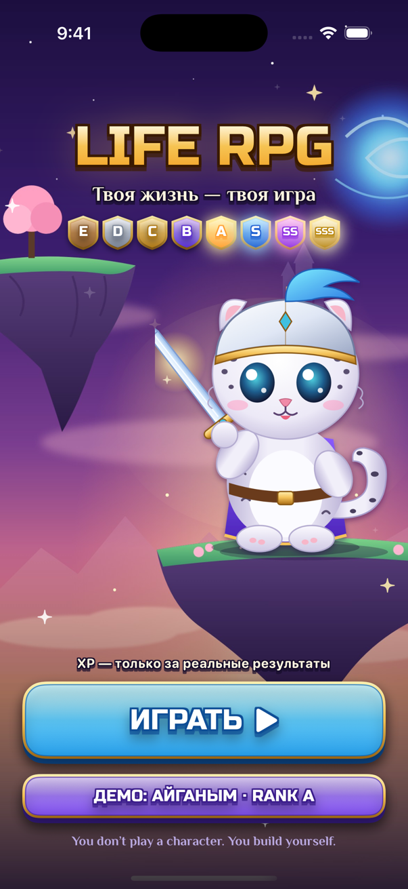
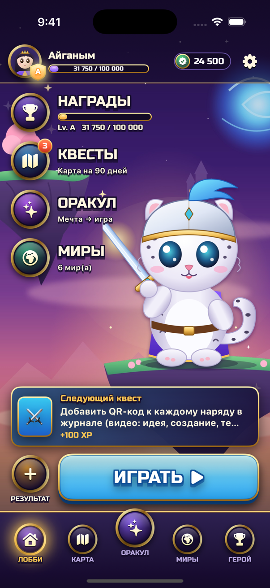
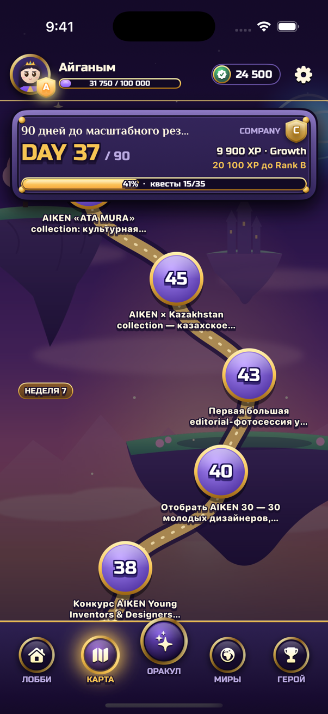
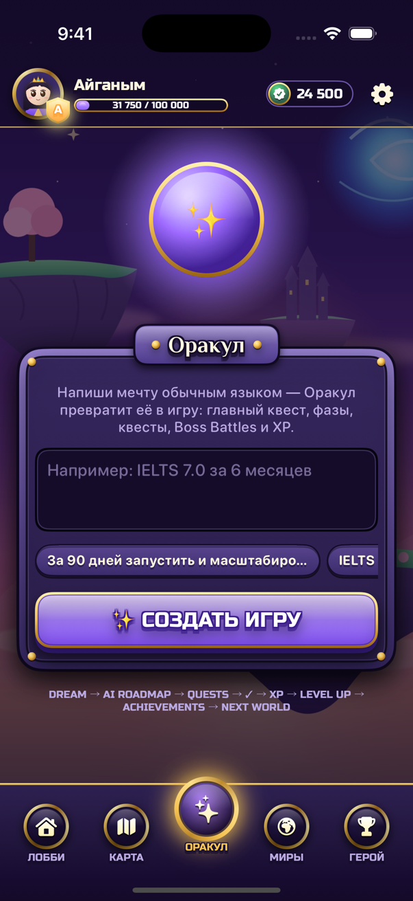
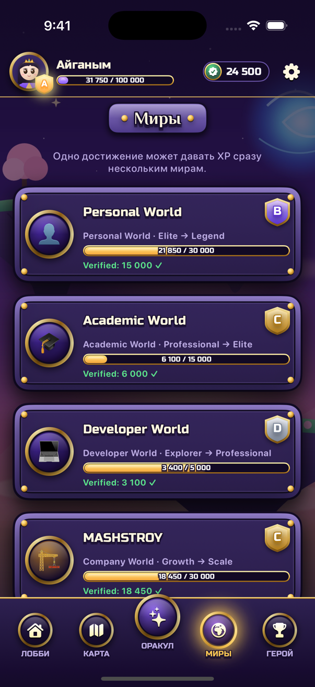
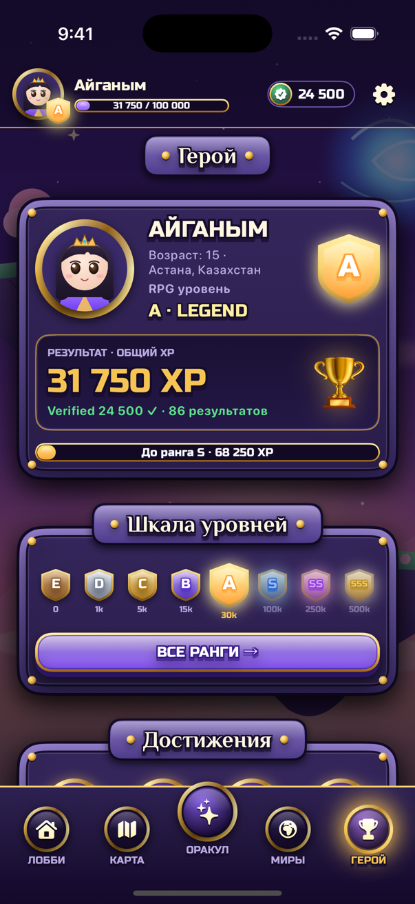
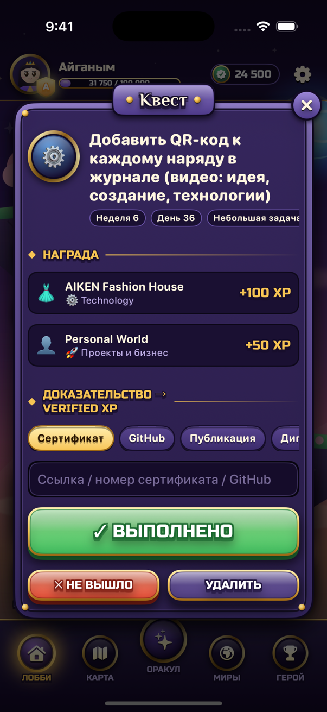
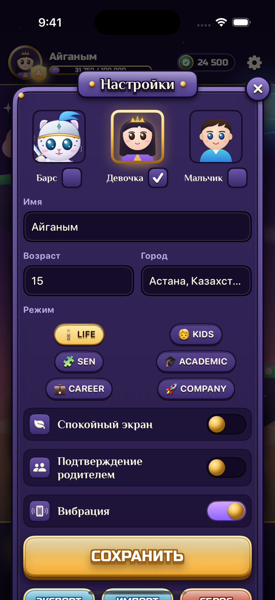
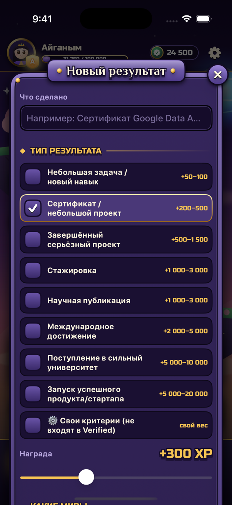

# ⚔️ LIFE RPG — Build Your World

> **Твоя жизнь — твоя игра. Прокачивай себя к легенде.**
> You don’t play a character. You build yourself. You don’t build a virtual empire. You build a real one.

LIFE RPG — мобильное приложение для геймификации реальной жизни. У каждого игрока есть профиль, ранг, XP, направления развития, миры, дорожные карты и достижения. **XP начисляется только за реальные результаты** — не за время в приложении.

🌐 **Веб-версия:** https://aiganymaset002-arch.github.io/life-rpg-/
На телефоне: открой ссылку → «Поделиться» → **«На экран Домой»** (iPhone) или «Установить приложение» (Android). Работает как обычное приложение, в том числе без интернета.

## 📱 iOS-приложение (SwiftUI, как KKSU)

Нативное приложение для iPhone и iPad: **`LifeRPG.xcodeproj`**.

1. Откройте **`LifeRPG.xcodeproj`** в Xcode 16 или новее (iOS 17+). Все файлы уже подключены.
2. Выберите симулятор iPhone и нажмите **Run (▶︎)**.
3. Чтобы поставить на свой iPhone: подключите телефон, выберите его вверху, в **Signing & Capabilities** выберите свою команду (Apple ID) и нажмите Run.

При каждом изменении GitHub Actions собирает приложение на Mac и прогоняет проверки игрового ядра (вкладка **Actions → iOS app**).

| Старт | Лобби | Карта-тропа 90 дней |
|---|---|---|
|  |  |  |
| **Оракул (Game Master)** | **Миры** | **Герой** |
|  |  |  |
| **Квест** | **Настройки** | **Новый результат** |
|  |  |  |

Дизайн — игровой: сумеречная фэнтези-сцена, свой маскот (снежный барс-рыцарь), медальоны в золотых кольцах, «3D»-кнопки, резные каменные панели, карта-тропа с узлами-уровнями и боссами. Шрифты Russo One и Philosopher (SIL OFL, с кириллицей) лежат в `LifeRPG/Fonts`, исходники иллюстраций — в `art/` (SVG).

```
LifeRPG.xcodeproj        проект Xcode — откройте его и нажмите Run
LifeRPG/App              точка входа приложения
LifeRPG/Core             модели, игровое ядро, AI Game Master, демо, хранилище, тема
LifeRPG/Features         экраны: онбординг, главная (Kids/SEN), карта, квест, Game Master, миры, профиль, ранги
LifeRPG/Assets.xcassets  иконка, фон-лобби, герой, аватары
LifeRPG/Fonts            игровые шрифты (OFL)
art/                     исходники иллюстраций (SVG)
Tests/CoreCheck          проверки игрового ядра
scripts/gen_xcodeproj.py пересобрать проект после добавления новых .swift файлов
```

---

## Ядро игры

```
DREAM → AI ROADMAP → QUESTS → ✓ COMPLETION → XP → LEVEL UP → ACHIEVEMENTS → NEXT WORLD
```

### Режимы
| Режим | Что это |
|---|---|
| 🧍 **LIFE** | Образование, карьера, здоровье, языки, финансы, отношения, проекты |
| 🧒 **KIDS** | Маленькие квесты, карта приключения 🌱 Starter → 🧭 Explorer → 🛠 Builder → 🚀 Inventor → 🏆 Master. Родитель подтверждает достижения |
| 🧩 **SEN** | Для детей и взрослых с РАС и ООП: экран «Сейчас / Потом», крупные визуальные шаги, предсказуемые награды, без анимаций |
| 🎓 **ACADEMIC** | Idea → Literature Review → Experiment → Paper → Submission → Review → Publication |
| 💼 **CAREER** | Python → Git → алгоритмы → проекты → open source → стажировка → Junior … |
| 🚀 **COMPANY** | Компания — RPG-персонаж: IDEA → VALIDATION → MVP → … → GLOBAL COMPANY |

### Ранги
`E Novice (0) → D Explorer (1 000) → C Professional (5 000) → B Elite (15 000) → A Legend (30 000) → S World Builder (100 000) → SS Icon (250 000) → SSS Legacy (500 000)`

Компании имеют свою шкалу (`C — Growth · 18 450 / 30 000 XP → B — Scale`), дети — свою.

### Стандартная шкала XP
| Результат | XP |
|---|---|
| Небольшая задача / новый навык | +50–100 |
| Сертификат / небольшой проект | +200–500 |
| Завершённый серьёзный проект | +500–1 500 |
| Стажировка | +1 000–3 000 |
| Научная публикация | +1 000–3 000 |
| Международное достижение | +2 000–5 000 |
| Поступление в сильный университет | +5 000–10 000 |
| Запуск успешного продукта/стартапа | +5 000–20 000 |

**Total XP vs Verified XP.** Можно создавать свои критерии и веса, но они идут только в Total XP. Verified XP ✓ — только результаты по стандартной шкале с доказательством (сертификат, GitHub, публикация, диплом, ссылка, портфолио, подтверждение родителя).

### Что умеет приложение
- **AI Game Master** — пишешь мечту обычным языком («Мне 15 лет. Я хочу через три года поступить в MIT и создать технологическую компанию») → получаешь игру: главный квест, фазы, квесты по дням, Boss Battles, XP. Понимает сроки («за 90 дней», «6 месяцев», «через три года»), названия компаний, IELTS-баллы, вузы; может объединять несколько целей.
- **Интерактивная карта-таймлайн** — `DAY 37 / 90`, недели/месяцы, выполненные карточки загораются ✓, текущий квест подсвечен, будущие полупрозрачны, Точка А → Точка Б.
- **Boss Battles** 🔥 — закрыты, пока не выполнены подготовительные квесты.
- **Перестройка маршрута** — «❌ Investment Quest failed → 🔄 New route unlocked: Bootstrap Strategy». Провал — не проигрыш.
- **Связанные миры** — одно достижение даёт XP сразу нескольким мирам (Personal, Academic, MASHSTROY R&D …).
- **Дерево развития компании** — Product / Team / Finance / Sales / Technology / R&D / Brand / International / Impact, ранг каждой ветки и подсказка: «Чтобы перейти на Rank B, слабое место — Sales. Выполни 3 квеста».
- **LEVEL UP!** с анимацией, достижения (First Research Publication, First International Step, Boss повержен …).
- Экспорт/импорт игры в JSON, офлайн-режим, данные хранятся только на телефоне.
- **Демо**: профиль Айганым — Rank A · 31 750 XP (Verified 24 500), миры MASHSTROY / ARAI / AIKEN и 90-дневная карта AIKEN Fashion House.

---

## Для разработчиков

Чистые HTML/CSS/JavaScript-модули, без сборки и зависимостей — PWA, которая разворачивается на GitHub Pages.

```
index.html            оболочка приложения
css/style.css         мобильная тема
js/data.js            ранги, категории, тарифы XP, режимы, миры
js/core.js            игровое ядро: XP, Verified XP, ранги, боссы, перестройка маршрута, достижения
js/gamemaster.js      AI Game Master: мечта → дорожная карта
js/demo.js            демо-игра
js/app.js             интерфейс
sw.js, manifest.webmanifest, icons/   PWA (установка на телефон, офлайн)
tests/                тесты ядра (node:test)
```

```bash
npm test     # тесты
npm start    # локальный сервер: http://localhost:5173
```

Публикация: при каждом push в `main` GitHub Actions прогоняет тесты и выкладывает сайт на GitHub Pages. Если Pages ещё не включены: **Settings → Pages → Source: GitHub Actions**.

Game Master сейчас работает офлайн на правилах и шаблонах. Функция `generate()` в `js/gamemaster.js` возвращает план в простом JSON-формате — туда можно подключить LLM, не меняя остальное приложение.
